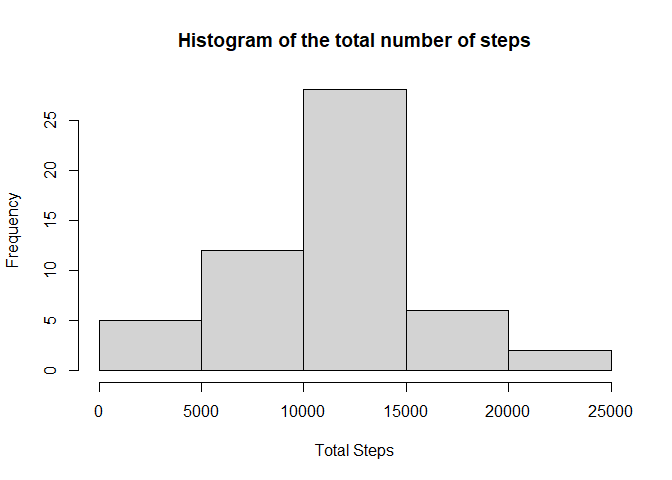

## Loading and preprocessing the data  

Show any code that is needed to  

1. Load the data (i.e. read.csv())  

```r
unzip("activity.zip")  
data <- read.csv("activity.csv")
```

2.  Process/transform the data (if necessary) into a format suitable for your analysis

```r
data$date <- as.Date(data$date)
#Sys.setlocale("LC_TIME","English") If necessary
```


## What is mean total number of steps taken per day?  
For this part of the assignment, you can ignore the missing values in the dataset.  
1. Make a histogram of the total number of steps taken each day  

```r
totalStepsDay <- tapply(data$steps, data$date, sum)  
hist(totalStepsDay,
      breaks = length(totalStepsDay),
      axes = FALSE,
      xlab = "Day",
      ylab = "Total Steps", 
      main = "Histogram of the total number of steps")
```

<!-- -->


## What is the average daily activity pattern?


## Imputing missing values


## Are there differences in activity patterns between weekdays and weekends?
