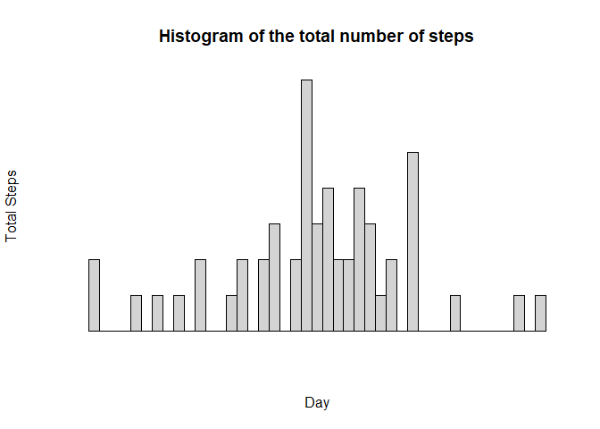
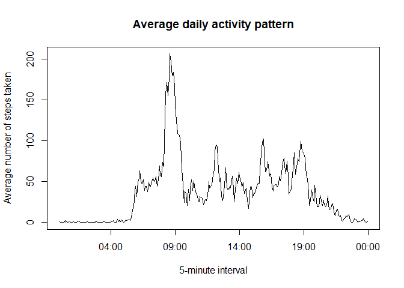
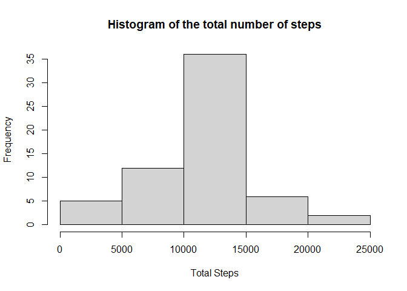
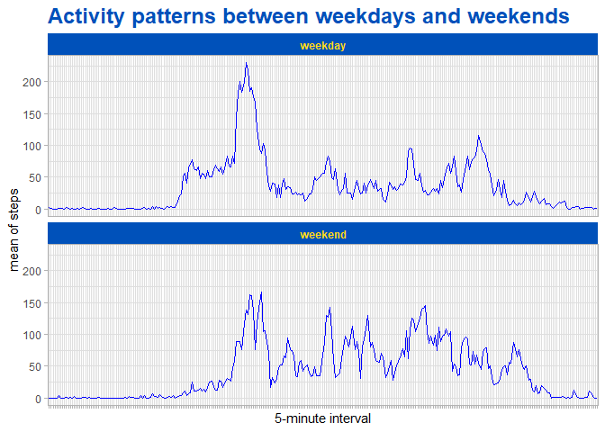

## Loading and preprocessing the data  

Show any code that is needed to  

1. Load the data (i.e. read.csv())  

```r
unzip("activity.zip")  
data <- read.csv("activity.csv")
```

2.  Process/transform the data (if necessary) into a format suitable for your analysis

```r
data$date <- as.Date(data$date)
Sys.setlocale("LC_TIME","English") #If necessary
```

```
## [1] "English_United States.1252"
```


## What is mean total number of steps taken per day?  
For this part of the assignment, you can ignore the missing values in the dataset.  
1. Make a histogram of the total number of steps taken each day  

```r
totalStepsDay <- tapply(data$steps, data$date, sum)  
hist(totalStepsDay,
      xlab = "Total Steps", 
      main = "Histogram of the total number of steps")
```

<!-- -->

2. Calculate and report the **mean** and **median** total number of steps taken per day


```r
print(paste("The median is ",median(totalStepsDay, na.rm = TRUE)))
```

```
## [1] "The median is  10765"
```

```r
print(paste("The mean is ",mean(totalStepsDay, na.rm = TRUE)))
```

```
## [1] "The mean is  10766.1886792453"
```

## What is the average daily activity pattern?  
1. Make a time series plot (i.e. type = "l") of the 5-minute interval (x-axis) and the average number of steps taken, averaged across all days (y-axis)  

```r
intervalSteps <- tapply(data$steps, data$interval, mean , na.rm=TRUE)  
intervalSteps <- data.frame(interval= row.names(intervalSteps) , mean.steps=intervalSteps )  
intervalSteps$hhdd <- stringr::str_pad(intervalSteps$interval,4,pad="0")  
intervalSteps$HM <- strptime(intervalSteps$hhdd,"%H%M")  
plot(intervalSteps$HM,intervalSteps$mean.steps, type="l",
      xlab = "5-minute interval",
      ylab = "Average number of steps taken", 
      main = "Average daily activity pattern")   
```

<!-- -->

2. Which 5-minute interval, on average across all the days in the dataset, contains the maximum number of steps?  

```r
print(paste("The 5-minute interval, on average across all the days in the dataset that contains the maximum number of steps is ",intervalSteps[which.max(intervalSteps$mean.steps),1]))  
```

```
## [1] "The 5-minute interval, on average across all the days in the dataset that contains the maximum number of steps is  835"
```


## Imputing missing values  
Note that there are a number of days/intervals where there are missing values (coded as NA). The presence of missing days may introduce bias into some calculations or summaries of the data.  
1. Calculate and report the total number of missing values in the dataset (i.e. the total number of rows with NAs) 

```r
print(paste("The total number of missing values in the dataset is ",sum(is.na(data))))
```

```
## [1] "The total number of missing values in the dataset is  2304"
```

2. Devise a strategy for filling in all of the missing values in the dataset. The strategy does not need to be sophisticated. For example, you could use the mean/median for that day, or the mean for that 5-minute interval, etc.  

```r
indexes <- intervalSteps[,1:2]
myfunction <- function(data , index){
  newData <- data
  for(i in 1:length(data[,1])){
    if(is.na(data[i,1])){
      int <- data[i,3]
      value <- dplyr::filter(indexes,interval==int)[2]
      newData[i,1] <- value
    }
  }
return(newData)
}
```

3. Create a new dataset that is equal to the original dataset but with the missing data filled in.  

```r
newData <- myfunction(data,indexes)
head(newData)
```

```
##       steps       date interval
## 1 1.7169811 2012-10-01        0
## 2 0.3396226 2012-10-01        5
## 3 0.1320755 2012-10-01       10
## 4 0.1509434 2012-10-01       15
## 5 0.0754717 2012-10-01       20
## 6 2.0943396 2012-10-01       25
```

4. Make a histogram of the total number of steps taken each day and Calculate and report the mean and median total number of steps taken per day. Do these values differ from the estimates from the first part of the assignment? What is the impact of imputing missing data on the estimates of the total daily number of steps?  

```r
totalStepsDayNONA <- tapply(newData$steps, newData$date, sum)  
hist(totalStepsDayNONA,
      xlab = "Total Steps", 
      main = "Histogram of the total number of steps")  
```

<!-- -->

```r
print(paste("The median is ",median(totalStepsDayNONA)))
```

```
## [1] "The median is  10766.1886792453"
```

```r
print(paste("The mean is ",mean(totalStepsDayNONA)))
```

```
## [1] "The mean is  10766.1886792453"
```
Summary of the data with NA  

```r
summary(totalStepsDay)
```

```
##    Min. 1st Qu.  Median    Mean 3rd Qu.    Max.    NA's 
##      41    8841   10765   10766   13294   21194       8
```
Summary of the data with imputting missing data  

```r
summary(totalStepsDayNONA)
```

```
##    Min. 1st Qu.  Median    Mean 3rd Qu.    Max. 
##      41    9819   10766   10766   12811   21194
```

## Are there differences in activity patterns between weekdays and weekends?  
For this part the weekdays() function may be of some help here. Use the dataset with the filled-in missing values for this part.  

1. Create a new factor variable in the dataset with two levels – “weekday” and “weekend” indicating whether a given date is a weekday or weekend day. 

```r
newData$interval <- stringr::str_pad(newData$interval,4,pad="0")  
newData$HM <- strptime(paste(newData$date,newData$interval),"%Y-%m-%d%H%M") 
newData$day <- as.factor(weekdays(newData$date))
newData %<>% mutate(wday= as.factor(
                                if_else(newData$day %in% c("Saturday","Sunday"),
                                              true = "weekend",
                                              false = "weekday")))
```


2. Make a panel plot containing a time series plot (i.e. type = "l") of the 5-minute interval (x-axis) and the average number of steps taken, averaged across all weekday days or weekend days (y-axis).

```r
newData %<>% group_by(interval,wday) %>% summarise(mean=mean(steps))
theme_set(
  theme_light() + theme(legend.position = "top")
  )
a <-  ggplot(newData,aes(interval,mean , group = 1))
a   + facet_wrap( vars(wday),nrow = 2  ) +
      geom_line(colour = "blue") + 
      theme(strip.text.x = element_text(color= "#FFDA1A", face = "bold"),
            strip.background.x = element_rect(fill = "#0051BA"), 
            plot.title = element_text(size=18, color = "#0051BA" , face = "bold" ),
            axis.text.x.bottom = element_blank()) +
      labs(x ="5-minute interval" , y ="mean of steps", title = "Activity patterns between weekdays and weekends")
```

<!-- -->


