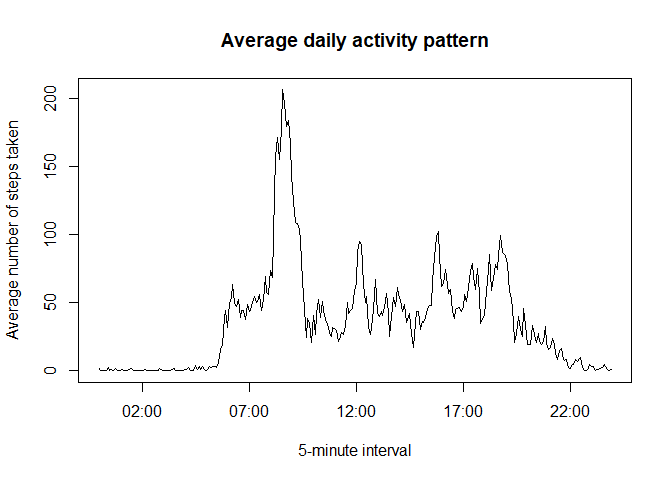

## Loading and preprocessing the data  

Show any code that is needed to  

1. Load the data (i.e. read.csv())  

```r
unzip("activity.zip")  
data <- read.csv("activity.csv")
```

2.  Process/transform the data (if necessary) into a format suitable for your analysis

```r
data$date <- as.Date(data$date)
#Sys.setlocale("LC_TIME","English") If necessary
```


## What is mean total number of steps taken per day?  
For this part of the assignment, you can ignore the missing values in the dataset.  
1. Make a histogram of the total number of steps taken each day  

```r
totalStepsDay <- tapply(data$steps, data$date, sum)  
hist(totalStepsDay,
      #breaks = length(totalStepsDay),
      #xaxt = "n",
      #xlab = "Day",
      xlab = "Total Steps", 
      main = "Histogram of the total number of steps")
```

<!-- -->

2. Calculate and report the **mean** and **median** total number of steps taken per day


```r
print(paste("The median is ",median(totalStepsDay, na.rm = TRUE)))
```

```
## [1] "The median is  10765"
```

```r
print(paste("The mean is ",mean(totalStepsDay, na.rm = TRUE)))
```

```
## [1] "The mean is  10766.1886792453"
```

## What is the average daily activity pattern?  
1. Make a time series plot (i.e. type = "l") of the 5-minute interval (x-axis) and the average number of steps taken, averaged across all days (y-axis)  

```r
intervalSteps <- tapply(data$steps, data$interval, mean , na.rm=TRUE)  
intervalSteps <- data.frame(interval= row.names(intervalSteps) , mean.steps=intervalSteps )  
intervalSteps$hhdd <- stringr::str_pad(intervalSteps$interval,4,pad="0")  
intervalSteps$HM <- strptime(intervalSteps$hhdd,"%H%M")  
plot(intervalSteps$HM,intervalSteps$mean.steps, type="l",
      xlab = "5-minute interval",
      ylab = "Average number of steps taken", 
      main = "Average daily activity pattern")   
```

<!-- -->

2. Which 5-minute interval, on average across all the days in the dataset, contains the maximum number of steps?  

```r
print(paste("The 5-minute interval, on average across all the days in the dataset that contains the maximum number of steps is ",intervalSteps[which.max(intervalSteps$mean.steps),1]))  
```

```
## [1] "The 5-minute interval, on average across all the days in the dataset that contains the maximum number of steps is  835"
```


## Imputing missing values


## Are there differences in activity patterns between weekdays and weekends?
